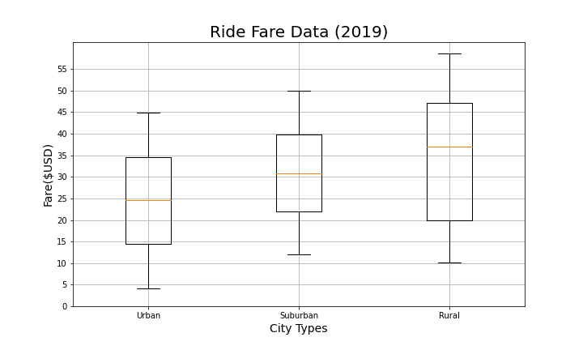

# PyBer_Analysis
# Analysis of Ride Share and Weekly Fare Summaries by City Type (Pyber-Internal Document)
## Analysis Overview
#### Prior Work
Previously, a comprehensive scatterplot was prepared to give an overview of how the size of the various city types (urban, suburban, and rural) affected the average fare. A varying bubble-size was used in the chart to indicate the size of each city’s market. Then, “box and whiskers” plots were employed to provide a visual aid to the statistics of, first the ride count data by city type, second the ride fare data by city type, and lastly the driver count data by city type. Finally, three pie charts were prepared, one to give a visual of the total fares of the city types, the ride share of the various city types, and another for the driver share by city type. 
#### Current Analysis
As a follow-on to the previous work, a summary table of the ride-sharing data by city type was prepared along with a multiple-line graph highlighting the total weekly fares for each city type. By request, the multi-line graph only included data in the date range of '2019-01-01' through '2019-04-29'. Recommendations were requested based on the analysis. 
## Results
-	**Total Rides:** The urban city market dominated the ride share at 1625 rides (68.4%) with the suburban ride share market coming in second at 625 rides (26.3%) in the same time period and the rural city ride share trailing at 125 rides (5.3%).
-	**Total Drivers:** Similarly, there were significantly more urban city drivers at 2405 (80.9%) than the 490 suburban drivers (16.5%) or the 78 rural drivers (2.6%). However, note that the rural drivers at 2.6% of the total driver count handled 5.3% of the total rides and the suburban drivers at 16.5% of the total driver count handled 26.3% of the rides. In contrast, the 2405 urban drivers representing 80.9% of the driver count only handled 68.4% of the rides.
-	**Total Fares:** There were similar indications in the breakdown of total fares by city type. At $39,854.38 in fares, the urban drivers handled 62.7% of the market (about 18% less than their percentage of the driver count). Suburban drivers handled $19,356.33 (30.5%) of the fares total and rural drivers were responsible for $4,327.93 (6.8%) of the fares.
-	**Average Fare per Ride:** Rural fares averaged $34.62 per ride, suburban fares averaged $30.97 per ride, and urban fares averaged $24.53 per ride. 
-	**Average Fare per Driver:** Rural fares averaged $55.49 per driver, suburban fares averaged $39.50 per driver, and urban fares averaged $16.57 per driver.
-	**Table highlighting the differences by city type:**
-	
-	**Total Fare by City Type:** Looking at the total fare by city type over time, the differences showed minimal volatility. The urban fare weekly totals never went below $1661.68 nor above $2470.93, the suburban weekly fare totals never went below $721.60 nor above $1412.74, and the rural fare totals never went below $67.65 nor above $501.24
-	**Chart of Total Fare by City Type Over Time**
-	

## Summary Recommendations
-	**Put the most focus on urban cities:** Currently, the urban city market is the largest and requires the most focus in both marketing and operations.  (However, as noted below, the suburban and rural markets should not be discounted.) Also, the urban city market appears to be somewhat less cost-efficient than the suburban and rural markets. This could simply be the nature of the urban ride share market and/or it could reflect inefficiencies in Pyber’s urban market operations, yet another reason to give the urban market more focus. 
-	**The suburban and rural markets are unique and need to be treated uniquely:** Despite being dwarfed by the urban city market, the suburban and rural markets are more cost efficient. It seems likely that in terms of land mass, rural areas still represent most of the space and in many areas, the majority of population, albeit spread further apart. They likely need marketing and operational support that is unique to their markets, and this support needs to be similarly cost efficient. 
-	**Proceed with the information at hand but also dig deeper:** There is enough information to proceed with the recommendations noted above, but there are still many questions it would be desirable to answer: Beyond Pyber’s share of the markets, how big are the markets overall? Who are the competitors and what is their share in the three markets? …and so on. Performing (or contracting to perform) this research will further clarify both the goals Pyber should set for itself as well as the methods for achieving those goals. 
## Appendix: Charts from prior analysis
-	The charts from the prior analysis are included here for reference:
-	
-	Note that the cutoff message to the right of the above chart indicates "Note: Circle size correlates with driver count per city."
-	
-	
-	
-	
-	
-	
